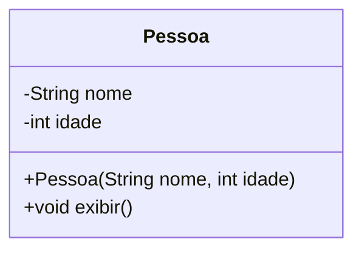
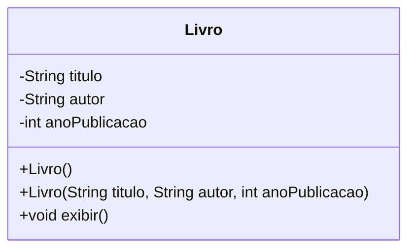
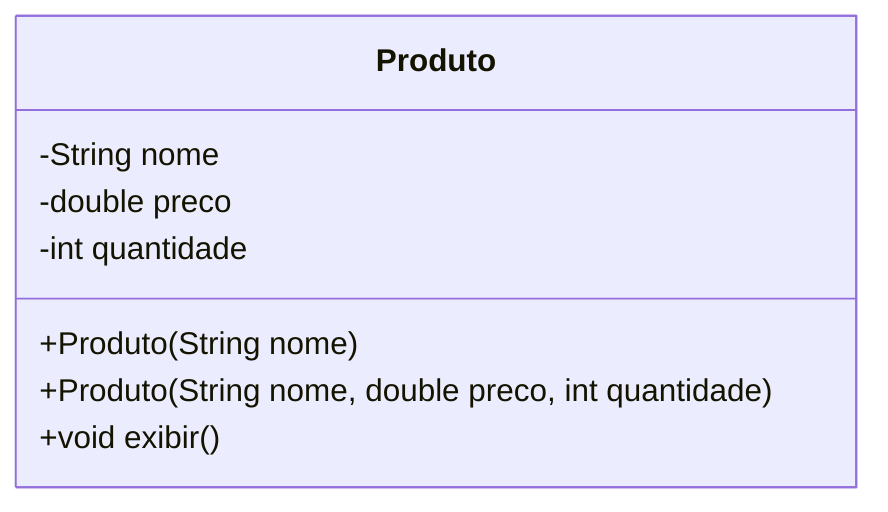
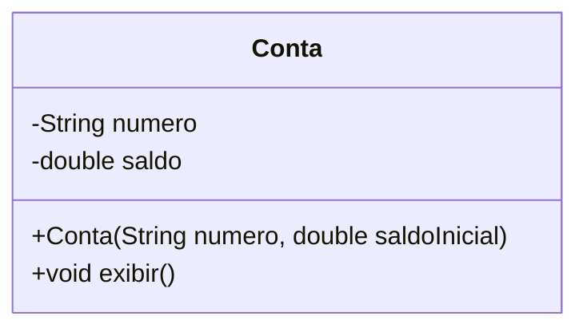
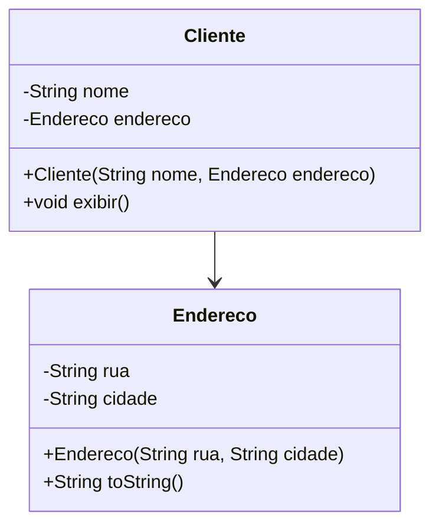
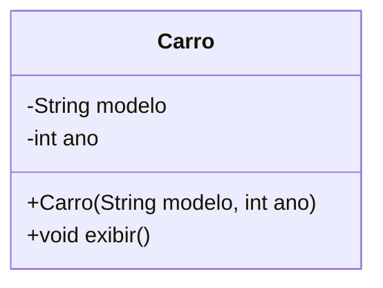

# Construtores

## **Exercício 1**

**Construtor com parâmetros**

Crie a classe `Pessoa` com os atributos `nome` e `idade`. O construtor deve receber esses dois dados. Implemente o método `exibir()` para imprimir os dados da pessoa.



💻 **Código no `main()`**:

```java
public class Main {
    public static void main(String[] args) {
        Pessoa p1 = new Pessoa("João", 25);
        Pessoa p2 = new Pessoa("Ana", 30);

        p1.exibir();
        p2.exibir();
    }
}
```

***

## **Exercício 2**&#x20;

**Construtor padrão e com sobrecarga**

Implemente a classe `Livro` com os atributos `titulo`, `autor` e `anoPublicacao`. Crie dois construtores: um padrão que define valores genéricos e outro que recebe todos os atributos.



💻 **Código no `main()`**:

```java
public class Main {
    public static void main(String[] args) {
        Livro l1 = new Livro();
        Livro l2 = new Livro("Dom Casmurro", "Machado de Assis", 1899);

        l1.exibir();
        l2.exibir();
    }
}
```

***

## **Exercício 3**

**Encadeamento de construtores (`this()`)**

Crie a classe `Produto` com sobrecarga de construtores. O construtor com apenas o nome deve assumir valores padrão para preço e quantidade, chamando outro construtor com `this()`.



💻 **Código no `main()`**:

```java
public class Main {
    public static void main(String[] args) {
        Produto p1 = new Produto("Caderno");
        Produto p2 = new Produto("Mouse", 89.90, 10);

        p1.exibir();
        p2.exibir();
    }
}
```

***

## **Exercício 4**

**Construtor com validação de dados**

Crie a classe `Conta` com os atributos `numero` e `saldoInicial`. No construtor, **valide** que o saldo inicial não seja negativo. Caso seja, atribua zero. Implemente o método `exibir()`.




💻 **Código no `main()`**:

```java
public class Main {
    public static void main(String[] args) {
        Conta c1 = new Conta("001", 500);
        Conta c2 = new Conta("002", -100); // saldo deve ser 0

        c1.exibir();
        c2.exibir();
    }
}
```

***

## **Exercício 5**

**Construtor com composição de objetos**

Implemente a classe `Endereco` e a classe `Cliente`. O construtor de `Cliente` deve receber um objeto `Endereco`. Use composição e exiba as informações completas.



💻 **Código no `main()`**:

```java
public class Main {
    public static void main(String[] args) {
        Endereco e = new Endereco("Av. Brasil", "São Paulo");
        Cliente c = new Cliente("Juliana", e);

        c.exibir();
    }
}
```

***

## **Exercício 6**

**Construtor com uso de `this` para diferenciar variáveis**

Crie a classe `Carro` com atributos `modelo` e `ano`. O construtor deve utilizar `this` para diferenciar parâmetros dos atributos da instância. Implemente o método `exibir()`.



💻 **Código no `main()`**:

```java
public class Main {
    public static void main(String[] args) {
        Carro c1 = new Carro("Civic", 2021);
        c1.exibir();
    }
}
```

