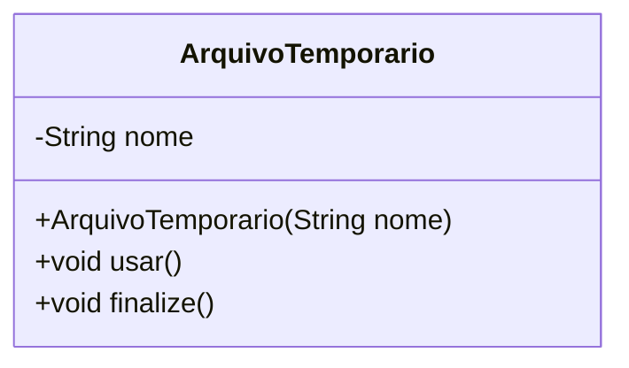
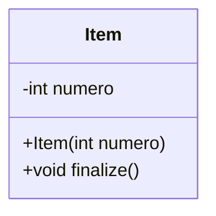
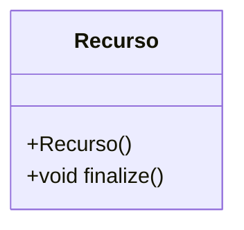

# Destrutores

## **Exercício 1**

**Sobrescrita do método `finalize()`**

Crie uma classe `ArquivoTemporario` que sobrescreva o método `finalize()` para simular a liberação de um arquivo temporário. Crie dois objetos e depois torne-os nulos. Solicite a coleta de lixo com `System.gc()`.



💻 **Código no `main()`**:

```java
public class Main {
    public static void main(String[] args) {
        ArquivoTemporario a1 = new ArquivoTemporario("temp1.txt");
        ArquivoTemporario a2 = new ArquivoTemporario("temp2.txt");

        a1.usar();
        a2.usar();

        a1 = null;
        a2 = null;

        System.gc(); // Solicita GC (não garante execução de finalize)
        System.out.println("Final do método main.");
    }
}
```

***

## Exercício 2

**Criar muitos objetos para forçar o GC**

Crie uma classe `Item` que imprime uma mensagem em seu `finalize()`. No `main()`, crie vários objetos `Item` em um loop sem guardar suas referências. Observe a execução do GC.



💻 **Código no `main()`**:

```java
public class Main {
    public static void main(String[] args) {
        for (int i = 0; i < 1000; i++) {
            new Item(i);
        }

        System.gc();
        System.out.println("Objetos criados. Aguardando GC...");
    }
}
```

***

## **Exercício 3**

**Objeto fora de escopo**

Crie uma classe `Recurso` com um método `finalize()` que imprime "Recurso coletado". No `main()`, crie o objeto dentro de um bloco `{}` e depois fora do bloco, chame `System.gc()`.



💻 **Código no `main()`**:

```java
public class Main {
    public static void main(String[] args) {
        {
            Recurso r = new Recurso();
        }

        System.gc(); // Objeto saiu do escopo e está elegível ao GC
        System.out.println("Aguardando coleta...");
    }
}
```
