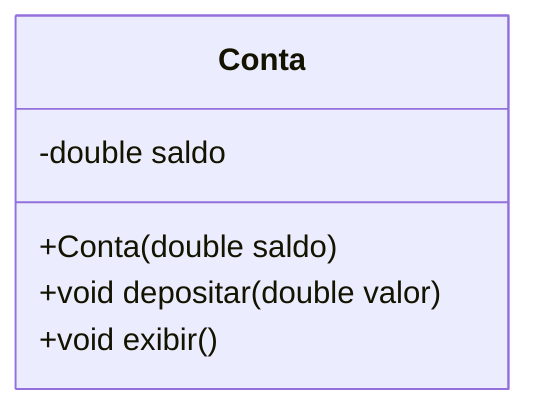
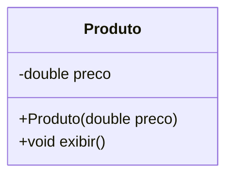
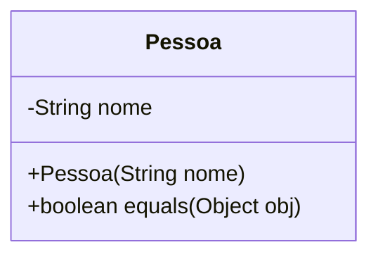
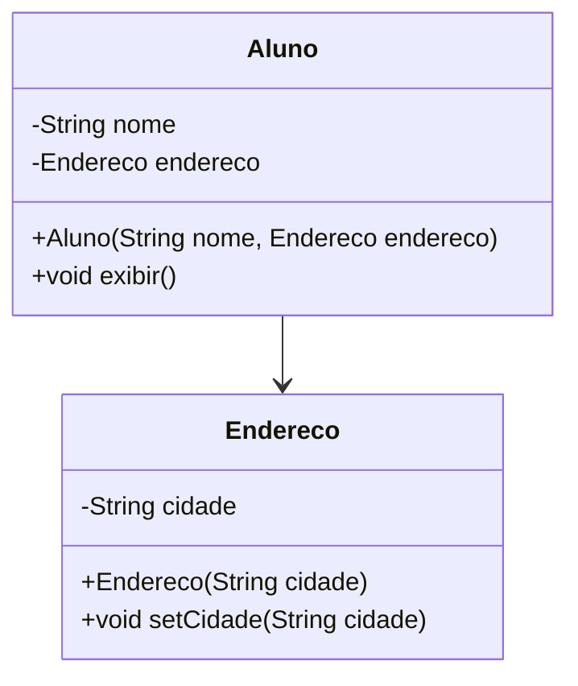
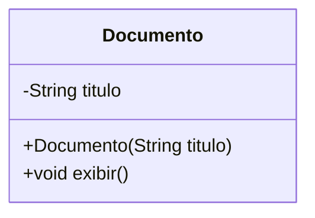
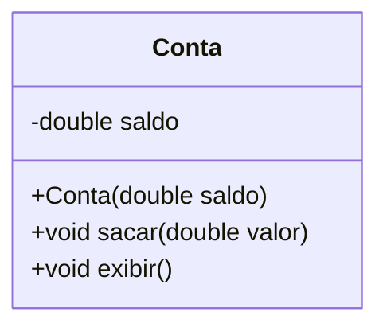
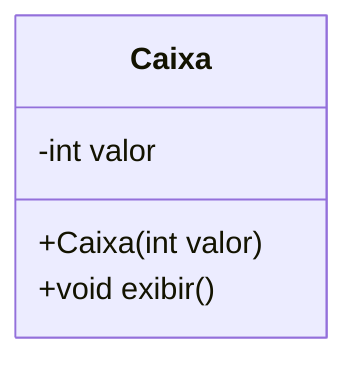

# Tipos Referência

## **Exercício 1**

**Referência compartilhada**

Crie uma classe `Conta` com um atributo `saldo`. Atribua o mesmo objeto a duas variáveis diferentes e altere o saldo usando uma delas. O que ocorre com a outra?



💻 **Código no `main()`**:

```java
Conta c1 = new Conta(1000);
Conta c2 = c1;

c2.depositar(500);
c1.exibir(); // saldo 1500
c2.exibir(); // saldo 1500
```

***

## **Exercício 2**

**Alteração de atributo em método**

Crie uma classe `Produto` com o atributo `preco`. Passe um objeto `Produto` para um método que altera esse preço. Verifique se a alteração é refletida fora do método.



💻 **Código no `main()`**:

```java
public static void aplicarDesconto(Produto p) {
    p.preco -= 10;
}

Produto prod = new Produto(50);
aplicarDesconto(prod);
prod.exibir(); // preço 40
```

***

## **Exercício 3**

**Substituição de referência em método**

Use a mesma classe `Produto`. Agora, em vez de alterar o atributo, atribua um novo objeto ao parâmetro dentro do método. Verifique se essa alteração afeta o objeto original.

💻 **Código no `main()`**:

```java
public static void redefinirProduto(Produto p) {
    p = new Produto(999); // nova referência
}

Produto p1 = new Produto(50);
redefinirProduto(p1);
p1.exibir(); // continua 50
```

***

## **Exercício 4**

**Comparação com `==` vs `.equals()`**

Crie dois objetos com os mesmos dados. Compare usando `==` e `equals()`. Implemente o método `equals()` corretamente.



💻 **Código no `main()`**:

```java
Pessoa p1 = new Pessoa("Ana");
Pessoa p2 = new Pessoa("Ana");

System.out.println(p1 == p2);        // false
System.out.println(p1.equals(p2));   // true (se implementado corretamente)
```

***

## **Exercício 5**

**Copiando objetos: shallow vs deep copy**

Implemente a classe `Aluno`, com um atributo `Endereco`. Crie dois objetos `Aluno` com o mesmo endereço (referência). Mostre que alterar o endereço de um afeta o outro (shallow copy). Depois, corrija com deep copy.



💻 **Código no `main()`**:

```java
Endereco end = new Endereco("Recife");
Aluno a1 = new Aluno("João", end);
Aluno a2 = new Aluno("Maria", end);

a2.endereco.setCidade("Natal");

a1.exibir(); // cidade Natal
a2.exibir(); // cidade Natal
```

***

## **Exercício 6**

**Referência nula e erro de execução**

Crie a classe `Documento` com um atributo `titulo`. Declare uma variável do tipo `Documento` e atribua `null`. Tente acessar um método e observe o que acontece.



💻 **Código no `main()`**:

```java
Documento d = null;
d.exibir(); // NullPointerException
```

***

## **Exercício 7**

**Cópia de referência x novo objeto**

Crie dois objetos `Conta`. Um recebe o valor do outro por atribuição. O segundo é alterado. Mostre que o primeiro também é alterado. Em seguida, crie um novo objeto independente e compare.



💻 **Código no `main()`**:

```java
Conta c1 = new Conta(1000);
Conta c2 = c1;
c2.sacar(200);

c1.exibir(); // saldo 800

Conta c3 = new Conta(1000); // objeto novo e independente
c3.sacar(300);
c1.exibir(); // continua 800
c3.exibir(); // saldo 700
```

***

## **Exercício 8**

**Objetos como parâmetros e efeitos colaterais**

Crie uma classe `Caixa` com um atributo `valor`. Faça um método que recebe um objeto `Caixa` e o modifica, e outro que recebe o mesmo tipo e apenas tenta substituir a referência. Observe os efeitos.



💻 **Código**:

```java
public static void alterarValor(Caixa c) {
    c.valor = 50;
}

public static void substituirReferencia(Caixa c) {
    c = new Caixa(99);
}

Caixa cx = new Caixa(10);
alterarValor(cx);
cx.exibir(); // 50

substituirReferencia(cx);
cx.exibir(); // ainda 50
```

***

## **Exercício 9**

**Stack vs Heap com tipos primitivos e objetos**

Crie duas variáveis primitivas `int` e modifique uma delas em um método. Faça o mesmo com um objeto. Compare os comportamentos em relação à **memória Stack e Heap**.

💻 **Código**:

```java
public static void alterarInt(int x) {
    x = 99;
}

public static void alterarObjeto(Caixa c) {
    c.valor = 99;
}

int a = 10;
alterarInt(a);
System.out.println(a); // 10

Caixa cx = new Caixa(10);
alterarObjeto(cx);
cx.exibir(); // 99
```

